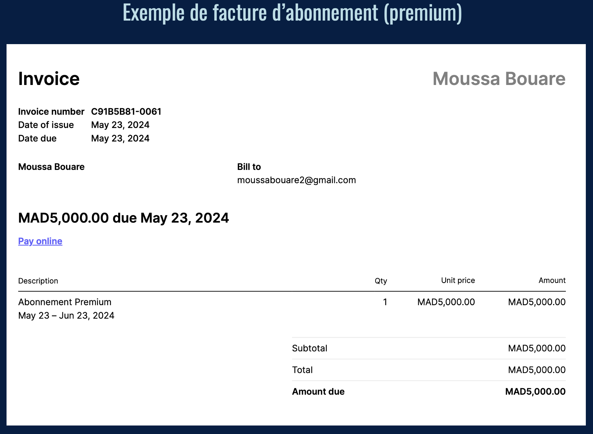
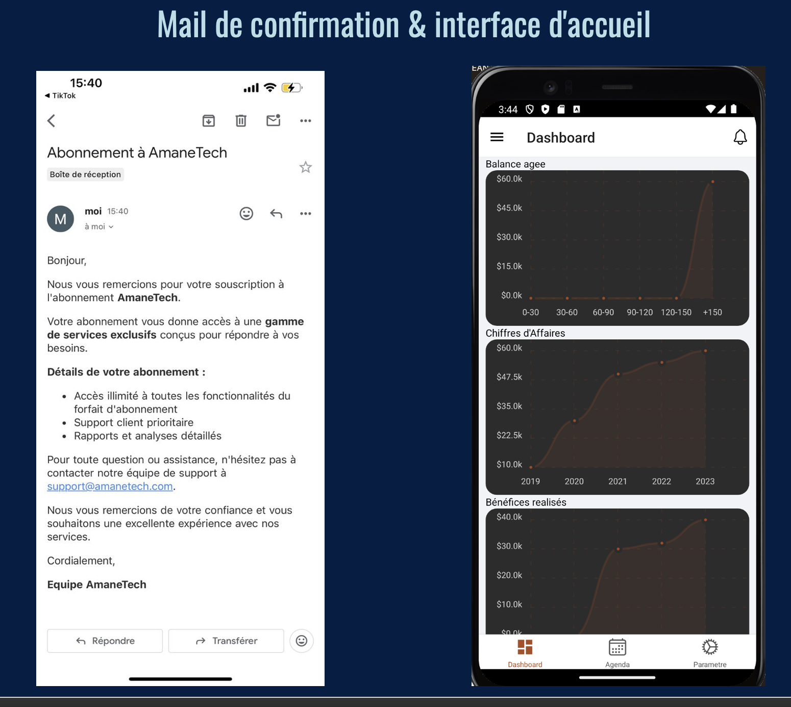
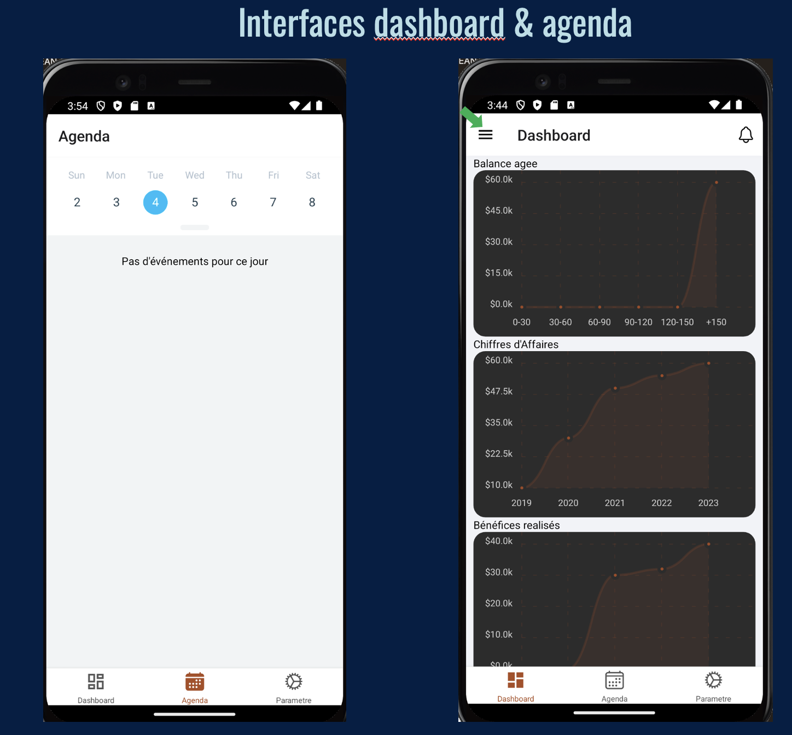
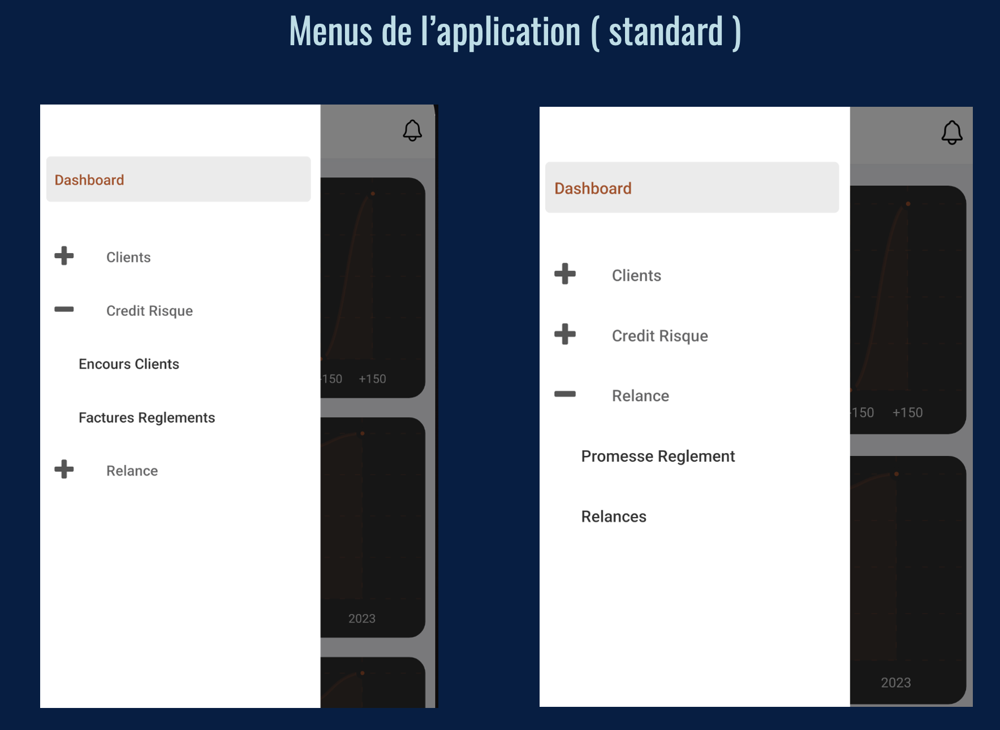
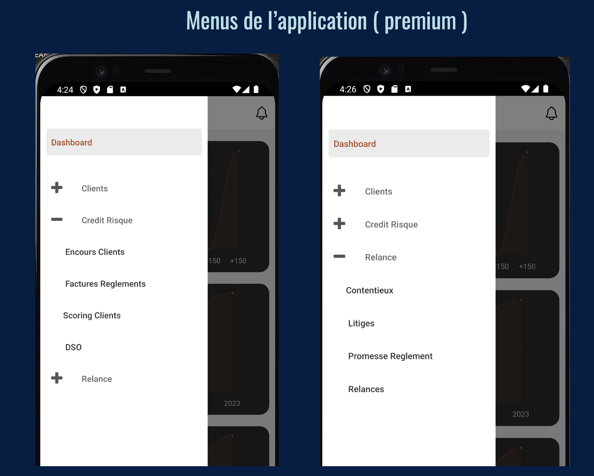
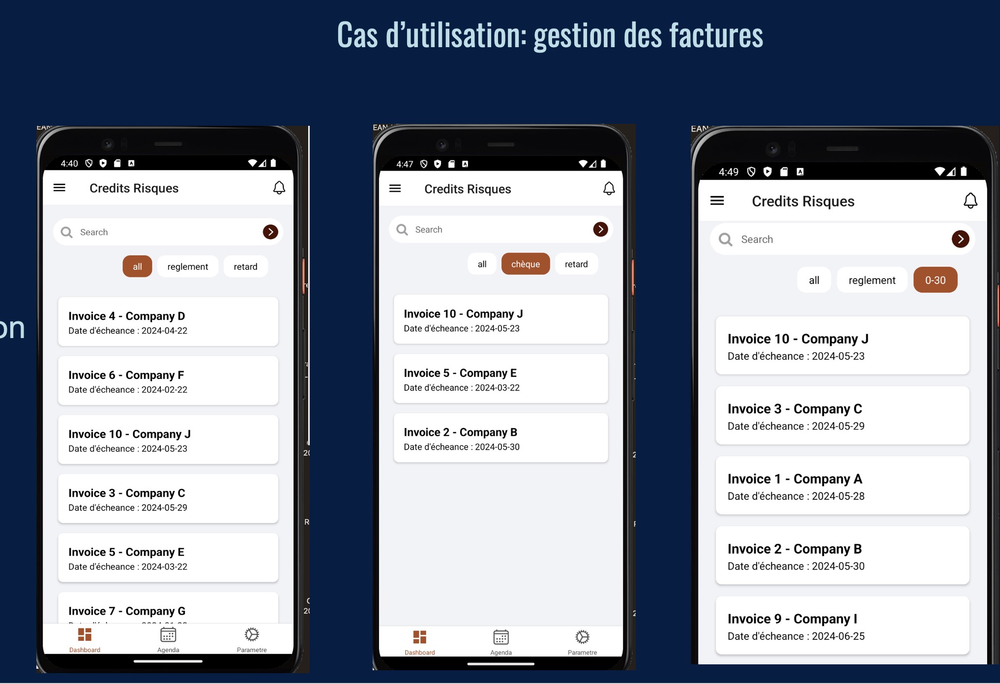
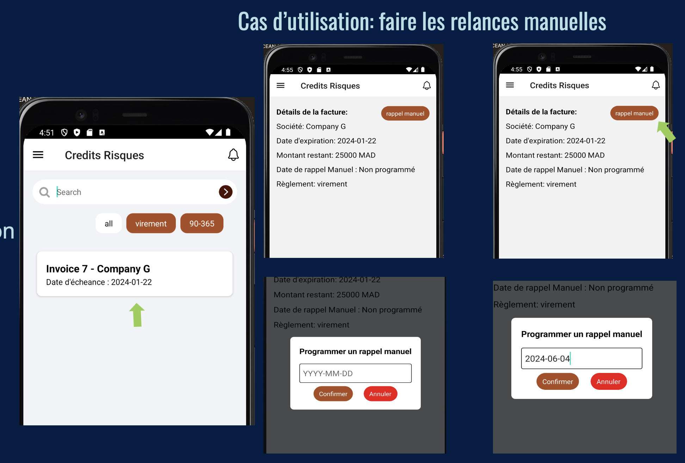

# AmmaneProject Mobile (React Native / Expo)

Application mobile (React Native) avec navigation, écrans métier (dashboard, clients, relances, credit/risque) et intégration Stripe (paiement).

## Features
- Auth (Sign In)
- Navigation (drawer + screens)
- Gestion Clients / Contrats / Immatriculations (écrans)
- Relances / Contentieux / Litiges (écrans)
- Credit & Risque (DSO, encours, scoring)
- Paiement via Stripe (test)

## Tech Stack
- React Native + Expo
- React Navigation
- Redux Toolkit (store + slices)
- Stripe React Native
- Expo Secure Store

## Screenshots

<p style="margin-bottom:16px;">
  
  
  
  
</p>

<details>
  <summary>More screenshots (WIP / extra screens)</summary>

  <p style="margin-bottom:16px;">
    
    
    
  </p>

  <p style="margin-bottom:16px;">
    
    
    
  </p>

</details>
## Getting Started

### Prerequisites
- Node.js (LTS)
- Expo CLI
- Un téléphone avec Expo Go (ou un émulateur)

### Install
```bash
npm install
```

### Run
```bash
npx expo start
```

## Configuration
### Stripe
Ce repo ne contient pas de clé Stripe.

Copier le fichier exemple :

```bash
cp src/config/stripe.example.js src/config/stripe.js
```

Modifier src/config/stripe.js et mettre votre pk_test_...

## Project Structure (simplifié)

App.js : entry

Navigation.js : navigation principale

screens/ : écrans UI

featuresSlices/ : Redux slices

store.js : Redux store

src/config/ : configs locales (stripe.js ignoré)

## Notes

Projet de démonstration : les clés/URLs sensibles ne sont pas commit.
